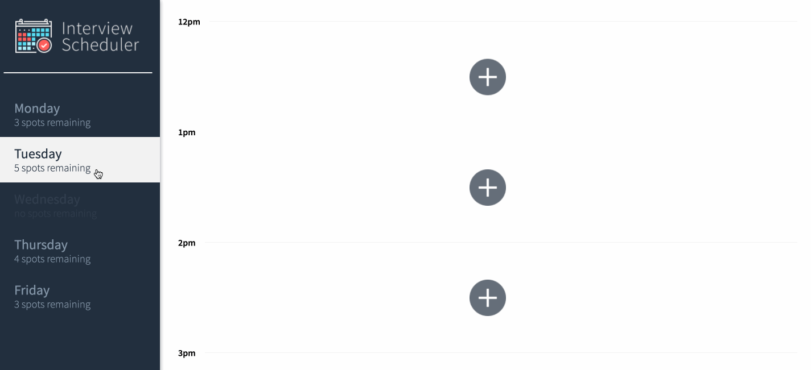
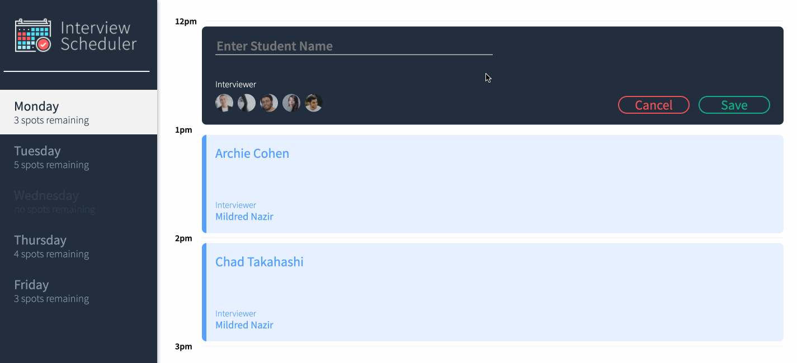
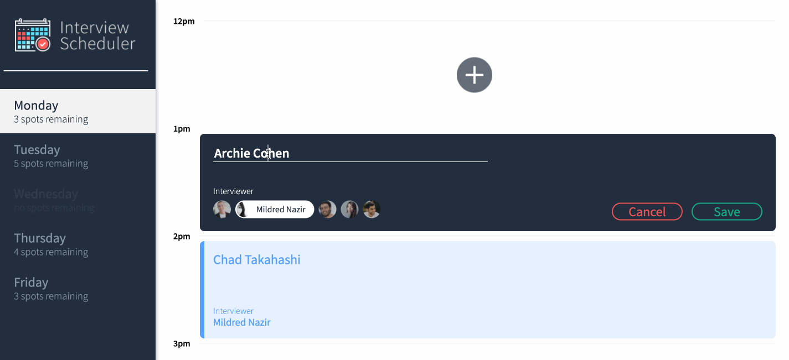
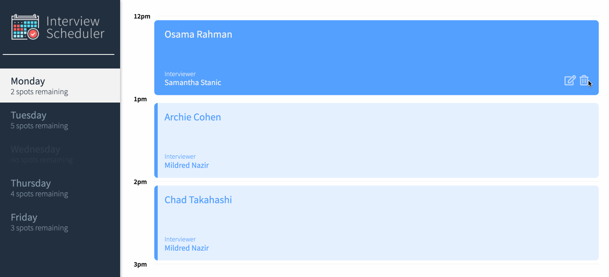

#  Scheduler

Scheduler is a great application that allows students to book interviews with their mentors. These interviews can be modified, deleted and added at will.









## Setup

Install dependencies with `npm install`.

## Running Webpack Development Server

```sh
npm start
```

## Running Jest Test Framework

```sh
npm test
```

## Running Storybook Visual Testbed

```sh
npm run storybook
```

## Running Cypress

```sh
npm run cypress
```
